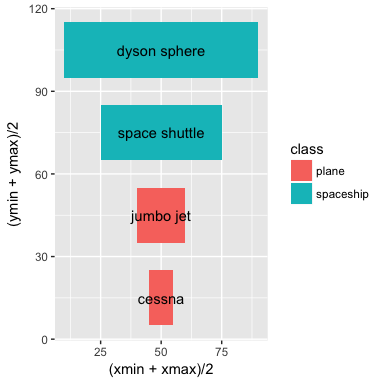
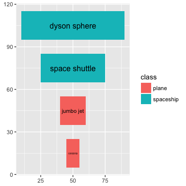
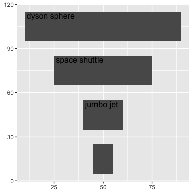
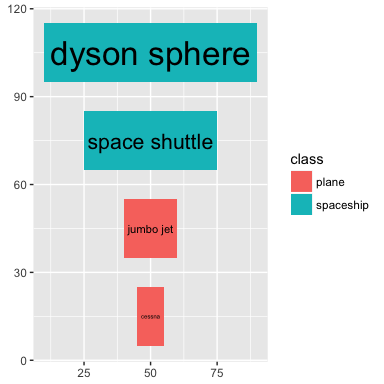

Installation
============

Install ggplot2 and devtools if you don't have them already.

``` r
install.packages("ggplot2")
install.packages("devtools")
```

Install ggfittext from github.

``` r
library(devtools)
install_github('wilkox/ggfittext')
```

Walkthrough
===========

Sometimes you want to draw some text in ggplot2 so that it doesn't spill outside a bounding box. For example, this doesn't look very good:

``` r
library(ggfittext)
kable(flyers)
```

| vehicle       | class     |  xmin|  xmax|  ymin|  ymax|
|:--------------|:----------|-----:|-----:|-----:|-----:|
| cessna        | plane     |    45|    55|     5|    25|
| jumbo jet     | plane     |    40|    60|    35|    55|
| space shuttle | spaceship |    25|    75|    65|    85|
| dyson sphere  | spaceship |    10|    90|    95|   115|

``` r
ggplot(flyers) +
  geom_rect(aes(xmin = xmin, xmax = xmax, ymin = ymin, ymax = ymax, fill = class)) +
  geom_text(aes(label = vehicle, x = (xmin + xmax) / 2, y = (ymin + ymax) / 2))
```



ggfittext provides a geom called `geom_fit_text` that will shrink text (when needed) to fit a bounding box.

``` r
ggplot(flyers, aes(xmin = xmin, xmax = xmax, ymin = ymin, ymax = ymax, label =
                   vehicle, fill = class)) +
  geom_rect() +
  geom_fit_text()
```



You can define the box with ‘xmin’ and ‘xmax’ aesthetics, or alternatively with ‘x’ and ‘width’ (width is given in millimetres). Likewise, you can use either ‘ymin’ and ‘ymax’ or ‘y’ and ‘height’. The ‘width’ and ‘height’ aesthetics can be useful when drawing on a discrete axis.

You can specify where in the bounding box to place the text with `place`, and a minimum size for the text with `min.size`. (Any text that would need to be smaller than `min.size` to fit the box will be hidden.)

``` r
ggplot(flyers, aes(xmin = xmin, xmax = xmax, ymin = ymin, ymax = ymax, label =
                   vehicle, fill = class)) +
  geom_rect() +
  geom_fit_text(place = "topleft", min.size = 8)
```



Text can be placed in any corner or at the midpoint of any side (‘topleft’, ‘top’, ‘topright’, ‘right’…), as well as the default ‘centre’.

With the `grow = T` argument, text will be grown as well as shrunk to fit the box:

``` r
ggplot(flyers, aes(xmin = xmin, xmax = xmax, ymin = ymin, ymax = ymax, label =
                   vehicle, fill = class)) +
  geom_rect() +
  geom_fit_text(grow = T)
```


