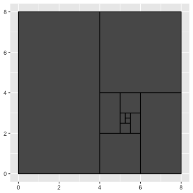
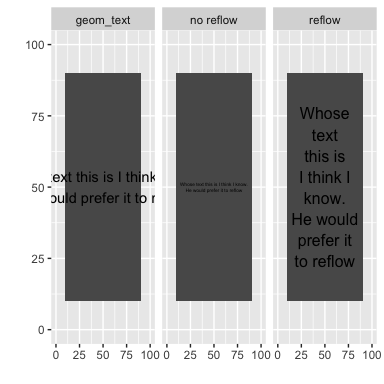
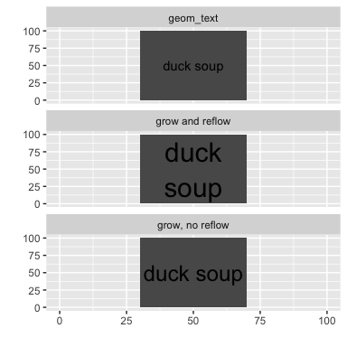

-   [Installation](#installation)
-   [Fitting text to a box](#fitting-text-to-a-box)
-   [Growing text](#growing-text)
-   [Reflowing text](#reflowing-text)

[](https://travis-ci.org/wilkox/ggfittext)

**ggfittext provides ggplot2 geoms for fitting text into a bounding box**



Installation
============

Install ggplot2 and devtools if you don't have them already.

``` r
install.packages("ggplot2")
install.packages("devtools")
```

Install ggfittext from github.

``` r
library(devtools)
install_github('wilkox/ggfittext')
```

Fitting text to a box
=====================

Sometimes you want to draw some text in ggplot2 so that it doesn't spill outside a bounding box. ggfittext provides a geom called `geom_fit_text` that will shrink text (when needed) to fit a bounding box.

``` r
library(ggfittext)
flyers <- data.frame(
  vehicle = rep(c("kite", "jumbo jet", "space shuttle", "dyson sphere"), 2),
  xmin = rep(c(52.5, 45, 30, 0), 2),
  xmax = rep(c(67.5, 75, 90, 120), 2),
  ymin = rep(c(0, 15, 35, 60), 2),
  ymax = rep(c(10, 30, 55, 85), 2),
  geom = factor(c(rep("geom_text", 4), rep("geom_fit_text", 4)),
                levels = c("geom_text", "geom_fit_text"))
)
ggplot(flyers, aes(label = vehicle, xmin = xmin, xmax = xmax, ymin = ymin, ymax = ymax)) +
  geom_rect() +
  geom_text(
    data = subset(flyers, geom == "geom_text"),
    aes(x = (xmin + xmax) / 2, y = (ymin + ymax) / 2)
  ) +
  geom_fit_text(data = subset(flyers, geom == "geom_fit_text")) +
  facet_wrap( ~ geom) +
  labs(x = "", y = "")
```


You can define the box with ‘xmin’ and ‘xmax’ aesthetics, or alternatively with ‘x’ and ‘width’ (width is given in millimetres). Likewise, you can use either ‘ymin’ and ‘ymax’ or ‘y’ and ‘height’. The ‘width’ and ‘height’ aesthetics can be useful when drawing on a discrete axis.

You can specify where in the bounding box to place the text with `place`, and a minimum size for the text with `min.size`. (Any text that would need to be smaller than `min.size` to fit the box will be hidden.)

``` r
ggplot(flyers, aes(label = vehicle, xmin = xmin, xmax = xmax, ymin = ymin, ymax = ymax)) +
  geom_rect() +
  geom_text(
    data = subset(flyers, geom == "geom_text"),
    aes(x = (xmin + xmax) / 2, y = (ymin + ymax) / 2)
  ) +
  geom_fit_text(
    data = subset(flyers, geom == "geom_fit_text"),
    place = "top",
    min.size = 6
  ) +
  facet_wrap( ~ geom) +
  labs(x = "", y = "")
```


Text can be placed in any corner or at the midpoint of any side (‘topleft’, ‘top’, ‘topright’, ‘right’…), as well as the default ‘centre’.

Growing text
============

With the `grow = TRUE` argument, text will be grown as well as shrunk to fit the box:

``` r
ggplot(flyers, aes(label = vehicle, xmin = xmin, xmax = xmax, ymin = ymin, ymax = ymax)) +
  geom_rect() +
  geom_text(
    data = subset(flyers, geom == "geom_text"),
    aes(x = (xmin + xmax) / 2, y = (ymin + ymax) / 2)
  ) +
  geom_fit_text(
    data = subset(flyers, geom == "geom_fit_text"),
    grow = T
  ) +
  facet_wrap( ~ geom, ncol = 1) +
  labs(x = "", y = "")
```


Reflowing text
==============

The `reflow = TRUE` argument causes text to be reflowed (wrapped) as needed to fit the bounding box. Reflowing is preferred to shrinking; that is, if the text can be made to fit by reflowing it without shrinking it, it will be reflowed only.

``` r
poem <- data.frame(
  text = rep(
    "Whose words these are I think I know.\nHe would prefer that they reflow",
    3
  ),
  xmin = rep(10, 3),
  xmax = rep(90, 3),
  ymin = rep(10, 3),
  ymax = rep(90, 3),
  fit = c("geom_text", "without reflow", "with reflow")
)
ggplot(poem, aes(xmin = xmin, xmax = xmax, ymin = ymin, ymax = ymax,
                 label = text)) +
  geom_rect() +
  geom_text(
    data = subset(poem, fit == "geom_text"),
    aes(x = (xmin + xmax) / 2, y = (ymin + ymax) / 2)
  ) +
  geom_fit_text(data = subset(poem, fit == "without reflow"), min.size = 0) +
  geom_fit_text(data = subset(poem, fit == "with reflow"), reflow = TRUE, min.size = 0) +
  lims(x = c(0, 100), y = c(0, 100)) +
  labs(x = "", y = "") +
  facet_wrap(~ fit)
```



Note that existing line breaks in the text are respected.

If both `reflow = TRUE` and `grow = TRUE` are passed, the text will be reflowed to a form that best matches the aspect ratio of the bounding box, then grown to fit the box.

``` r
film <- data.frame(
  text = rep("duck soup", 3),
  xmin = rep(30, 3),
  xmax = rep(70, 3),
  ymin = rep(0, 3),
  ymax = rep(100, 3),
  fit = c("geom_text", "grow without reflow", "grow with reflow")
)
ggplot(film, aes(xmin = xmin, xmax = xmax, ymin = ymin, ymax = ymax,
                 label = text)) +
  geom_rect() +
  geom_text(
    data = subset(film, fit == "geom_text"),
    aes(x = (xmin + xmax) / 2, y = (ymin + ymax) / 2)
  ) +
  geom_fit_text(data = subset(film, fit == "grow without reflow"), grow = TRUE) +
  geom_fit_text(
    data = subset(film, fit == "grow with reflow"),
    grow = TRUE,
    reflow = TRUE
  ) +
  lims(x = c(0, 100), y = c(0, 100)) +
  labs(x = "", y = "") +
  facet_wrap(~ fit, ncol = 1)
```


