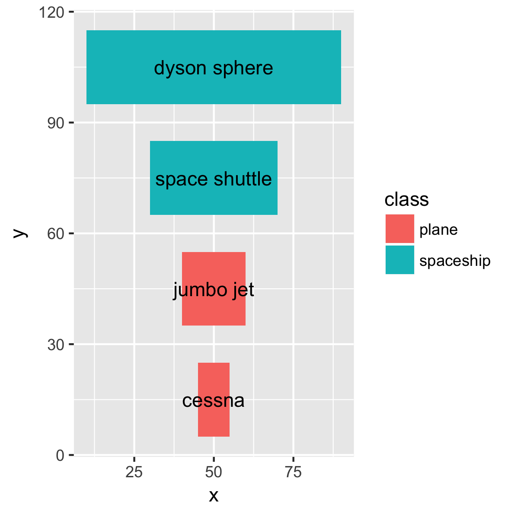

# Installation

Install ggplot2 and devtools if you don't have them already.

``` r
install.packages("ggplot2")
install.packages("devtools")
```

Install ggfittext.

``` r
library(devtools)
install_github('wilkox/ggfittext')
```

# `geom_shrink_text`

Sometimes you want to draw some text in ggplot2 so that it doesn't spill outside
a bounding box. For example:

``` r
library(ggfittext)
flyers
#>         vehicle xmin xmax ymin ymax     class  x    y
#> 1   light plane   10   20   10   20     plane 15 15.0
#> 2     jumbo jet   20   90   75   95     plane 55 85.0
#> 3 space shuttle   80   90   15   50 spaceship 85 32.5
#> 4  dyson sphere   25   75   25   60 spaceship 50 42.5
ggplot(flyers) +
  geom_rect(aes(xmin = xmin, xmax = xmax, ymin = ymin, ymax = ymax, fill = class)) +
  geom_text(aes(label = vehicle, x = x, y = y))
```



ggfittext provides two new ggplot2 geoms that help with fitting text to a box.
To shrink text down so it doesn't overflow a bounding box, use
`geom_shrink_text`:

``` r
ggplot(flyers, aes(xmin = xmin, xmax = xmax, ymin = ymin, ymax = ymax, label =
                   vehicle, fill = class)) +
  geom_rect() +
  geom_shrink_text()
```


Note that, unlike with `geom_text`, you don't need to provide explicit ‘x’ and
‘y’ aesthetics to position the text label. Instead, you supply the position of
the bounding box with ‘xmin’, ‘xmax’, ‘ymin’, ‘ymax’ and position the text
within the box with ‘place’.

You can specify where in the bounding box to place the text, and hide text that
would be shrunk below a minimum size:

``` r
ggplot(flyers, aes(xmin = xmin, xmax = xmax, ymin = ymin, ymax = ymax, label =
                   vehicle, fill = class)) +
  geom_rect() +
  geom_shrink_text(place = "topleft", min.size = 8)
```


The obvious set of placements (‘topleft’, ‘top’, ‘topright’...) are supported,
as well as the default ‘centre’. ‘vjust’ and ‘hjust’ are set automatically.

# `geom_fill_text`

`geom_fill_text` will expand the text label to fix the bounding box. The text
aspect ratio will be maintained, so usually the size of the text will only be
maximised along one axis. As with `geom_shrink_text`, you specify the position
of the boundary box and the placement of the text label within the box.
`geom_fill_text` only supports three places: ‘top’, ‘middle’ (the default) and
‘bottom’.

``` r
ggplot(flyers, aes(xmin = xmin, xmax = xmax, ymin = ymin, ymax = ymax, label =
                   vehicle, fill = class)) +
  geom_rect() +
  geom_fill_text()
```


